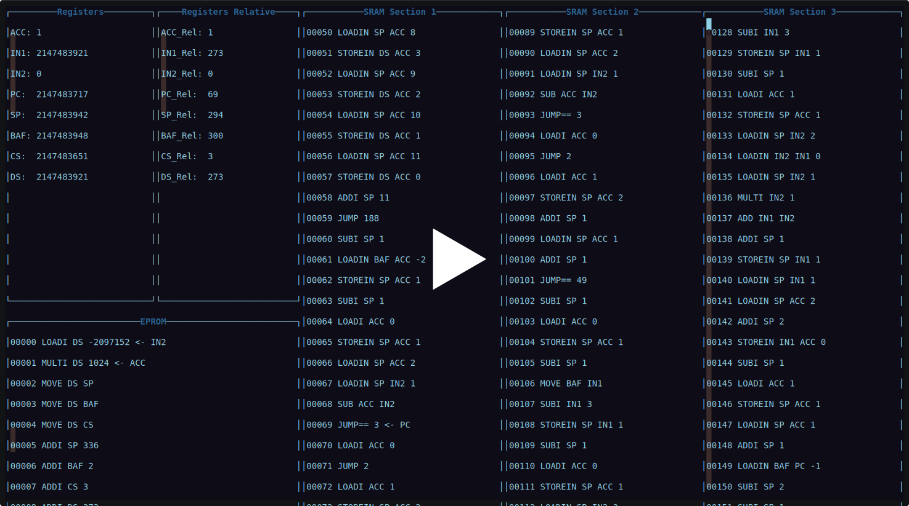

  

  

    <strong>Neovim plugin</strong> that acts as a <strong>Debugger</strong> for <strong>RETI assembler</strong>.
     
     
    <a href="https://youtu.be/RjGhruUwERQ?feature=shared">Video: Testing with provided Dockerfile</a> (recommended)
    ·
    <a href="https://youtu.be/p5zNdTiBRNg?feature=shared">Video: Manual installation for Ubuntu 24.04</a>
     
    <a href="https://youtu.be/rTsYTDNR0do?feature=shared">Video: Feature showcase and implementation details</a>
     
    <a href="https://github.com/matthejue/RETI-Debugger_Documentation/releases/download/master/Report.pdf">Report PDF</a> (Installation instructions in the Appendix)
    ·
    <a href="https://github.com/matthejue/RETI-Debugger_Documentation">Report Source code</a>
     
  

